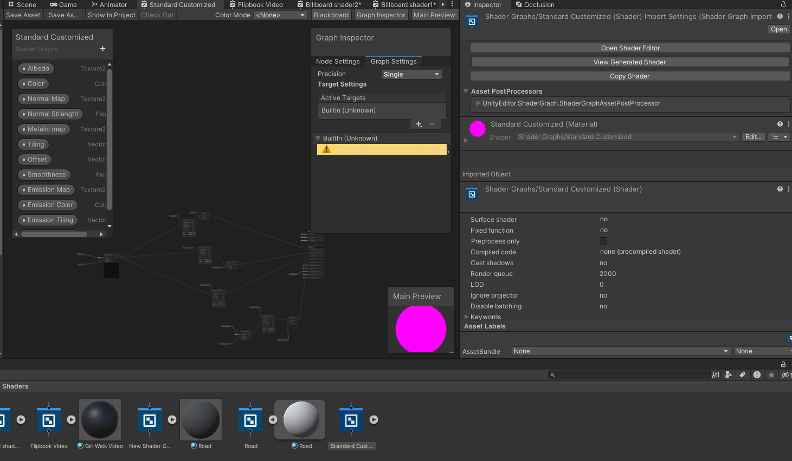
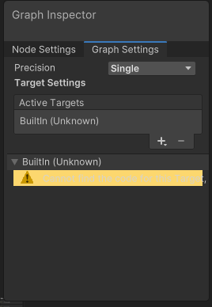
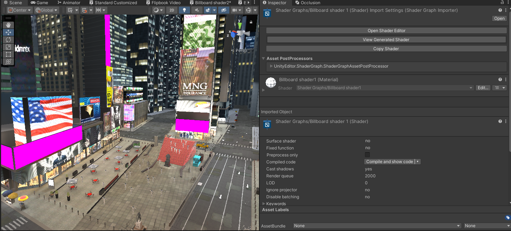

# Massive Loop | Template Worlds : Times Square

Massive Loop invites you to step into a collection of beautifully crafted virtual worlds. Each one designed to pull you in with atmosphere, detail, and presence. Whether you explore vibrant cityscapes, awesome fun games, tranquil environments, stylized fantasy realms, or community-built creations, Massive Loop provides an immersive platform where users, creators, and communities come together.

To help creators get started quickly, Massive Loop offers a suite of ready-to-use template worlds that you can download, customize, and expand. One of these templates is the Times Square environment a bustling showcase of interactive systems and visual polish. 

It includes an AI-driven crowd system powered by NavMesh agents, a lightweight waypoint-based traffic system, multiple advanced Shader Graph effects, and even a fully functional drivable vehicle implementation. Developers can explore the project, extend its mechanics, or use it as a foundation for their own unique world. 

For those interested in the vehicle system specifically, that project is available here:
https://github.com/BrandonW24/Massive-Loop-CSharp-Car

## Unity Editor Requirements
Please Navigate to the package manager and ensure that the following two Unity packages, these are dependents :
* Post Processing
* ShaderGraphs

Please also make sure that your editor is using the Built-In Renderer.

## Seeing Pink Textures? No worries!
Sometimes, when exporting shadergraphs from the Unity Editor, shadergraphs can sometimes lose their active target locations. 

Luckily for us it is a very easy fix.

Navigate toward the Shaders folder found in the Times Square subfolder in the asset. You will want to click on the **"Open Shader Editor"** button

Next, where you see the **"Active Targets"** section in your graph inspector, simply click the plus button and select **"Built-In"**

Next, click on the **"BultIn (Unknown)"** Active target and remove it by pressing the minus button. Press **CTRL + S** on your keyboard and it should fix itself! 

If it does not reimport itself, right click on the shader and click **reimport**

And there you have it! 

Times Square will be restored to its glory, all thanks to you and the handy Shadergraph toolset!

*(Looks like I missed a couple billboards!)*

## Custom Shadergraphs not working correctly in VR? We've got you!
First, open your package manager window, and click on the plus icon in the top left corner. From there, you'll want to click on **"add a package from git URL"**

**Then paste the following git URL into that bar :**
https://github.com/z3y/ShaderGraphVRC.git

Lastly, you'll want to update your target to utilize the new **Built-In target.**

With that you should be all set to go!

## Setting Up Your Massive Loop World

Please ensure that you have the correct Unity Editor version that is compatible with our SDK. Currently, the Unity Editor version we recommend using is **Unity 2022.3.18f1**. This is subject to change.

You will need our most up to date SDK version which can be found at the following link : 
https://massiveloop.com/download/sdk/

As well as our most up to date client, which can be downloaded at this following link : 
https://massiveloop.com/download/browser/

To get a jump start on the process of registering, creating, testing, and uploading a world to Massive Loop, please refer to our documentation : https://docs.massiveloop.com/docs/create/create_new/create_new_world.html
